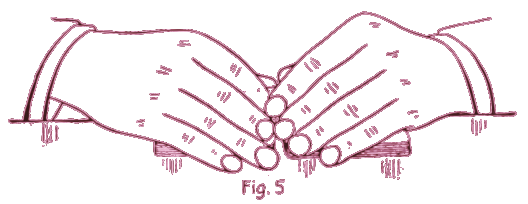

# I. To Retain the Top Stock

Upper cut about half the deck with right hand, place two packets end to end on the table in the usual position for riffling. Seize both packets at sides close to adjoining ends between the third finger and thumb of each hand, and rest the hands on the outer ends of packets. Raise the thumb corners, and at the same moment in-jog the top-card of the left-hand packet by drawing it in a little over the left thumb, with the first finger of the left hand. The first and second fingers of the left hand conceal both the jog and the action. \(See Fig. 5.\)

Then begin the release, and spring or riffle into each other the ends of the lower cards with both thumbs, but more rapidly with the left thumb, so that the left packet, with the exception of the top card \(which is retained on top of the left thumb\) will have been riffled in before the right thumb has released the cards of the top stock. Continue the action with the right thumb until all are released, then release last card held by the left thumb. \(See Fig. 6.\)

This action places one extra card on original top stock. To square up in the ordinary manner would expose the fact that the upper portion had not been riffled. Drop the left thumb on top card to hold the deck in position and shift the left hand so that the edge of the palm will rest on the table at the end of the left packet and the second and third fingers come along the side. Then with the right hand in much the same position as the left, but held more openly, push the right packet in and square up. \(See Fig. 7.\) Each time this riffle is made it leaves an extra card on top; and the top stock is usually arranged to require two or three extra cards. But if not required the extra card is gotten rid of by "Blind Cut No. I." After each or every second riffle execute blind cut "No. III To Retain the Top Stock."

This riffle though requiring considerable explanation, is quite simple, and as easily executed as the true. There is no hesitation in the thumb action, although one moves more rapidly than the other. The movements are natural; the positions of the hands are regular, and even the manner of pushing in the cards is the customary one of many players.

But, as intimated, to retain the top stock in the riffle is the exception. In most instances, when the blind is used, it is to retain the bottom stock, and that process which is next described, is even simpler and easier of execution, and more perfect in deception.

